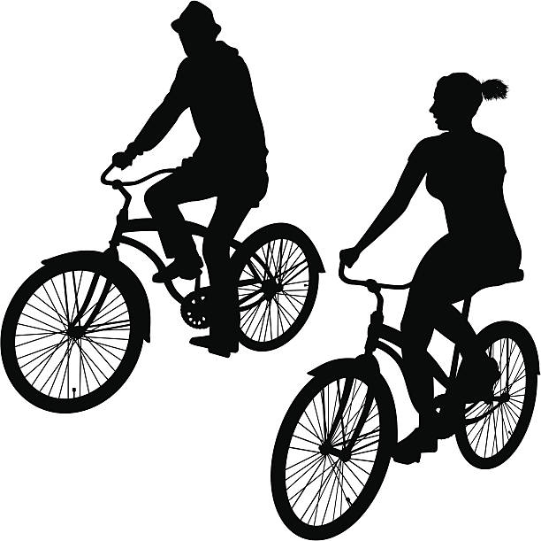
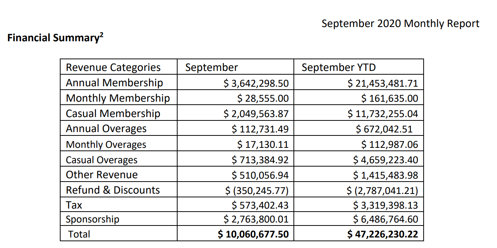
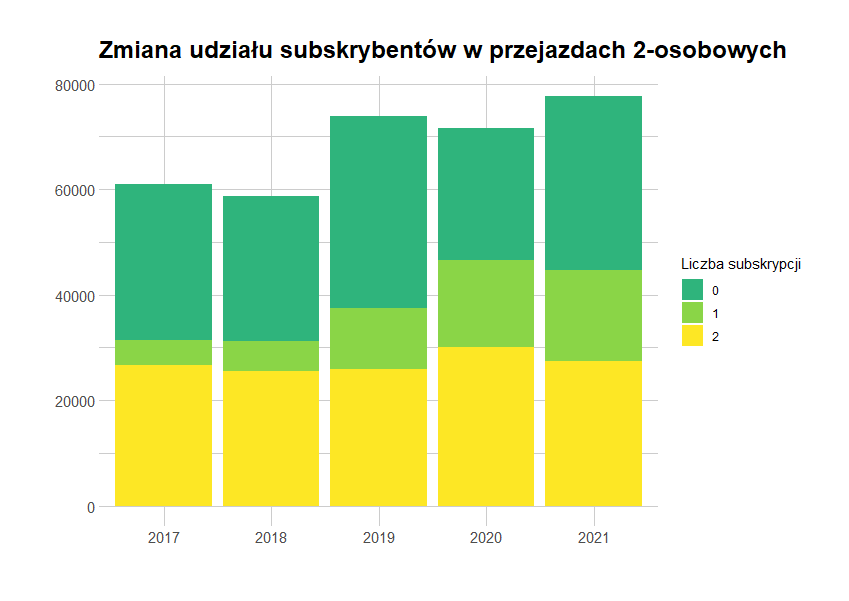
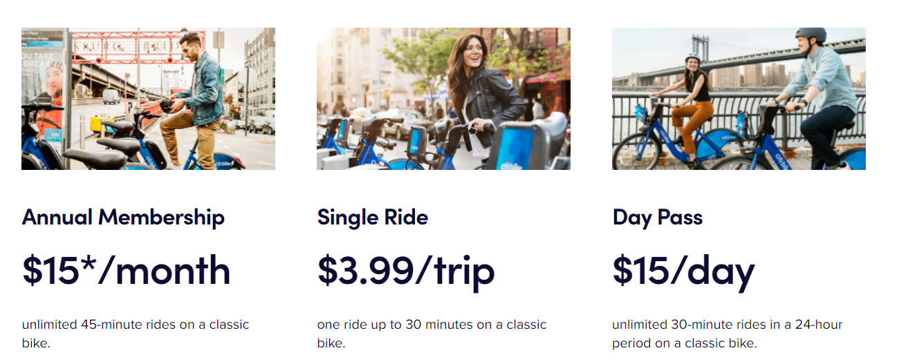
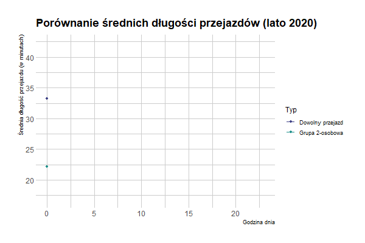
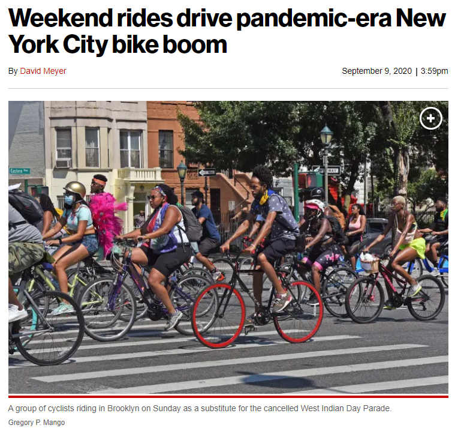
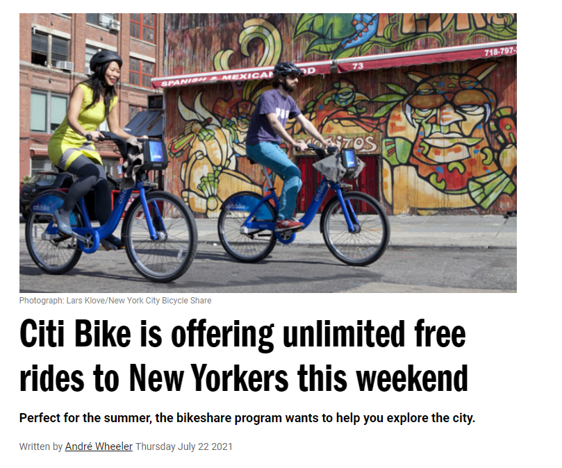

```{r message=FALSE, warning=FALSE, include=FALSE}
setwd("C:/Users/wojte/OneDrive/Pulpit") #Tu sobie ustaw jaką chcesz i dodaj do niej folder DanePD3
                                        # i powinno wystarczyć
knitr::opts_chunk$set(echo = TRUE)      
```


## Jaką rolę pełnią przejazdy dwuosobowe w modelu biznesowym CITI Bikes? {.bigger}
&nbsp;

- Dystrybucja subskrybcji w grupach
- Czas użytkowania z rowerów w ciągu dnia
- Preferencje ze względu na weekend/dzień powszedni

```{r echo=FALSE,fig.align="center",out.width = "400px"}

```


## Dystrybucja subskrypcji w grupach {.bigger}

<center>

</center>

## Dystrybucja subskrypcji w grupach {.bigger}
&nbsp;
&nbsp;
&nbsp;
```{r echo=FALSE,fig.align="center",out.width = "1000px",out.height = "800px"}

```

## Czas użytkowania z rowerów w ciągu dnia {.bigger}
&nbsp;
&nbsp;
&nbsp;
```{r echo=FALSE,fig.align="center",out.width = "1310px",out.height = "527px"}

```


## Czas użytkowania z rowerów w ciągu dnia {.bigger}

```{r echo=FALSE,fig.align="center",out.width = "800px",out.height = "600px"}

```

## Preferencje ze względu na weekend/dzień powszedni {.bigger}
&nbsp;
&nbsp;
&nbsp;
&nbsp;
```{r echo=FALSE,out.width = "800px",out.height = "600px"}


```

## Preferencje ze względu na weekend/dzień powszedni

```{r Interaktywny, echo=FALSE}
htmltools::includeHTML("./DanePD3/Wykresik_taki_o.html")
```

